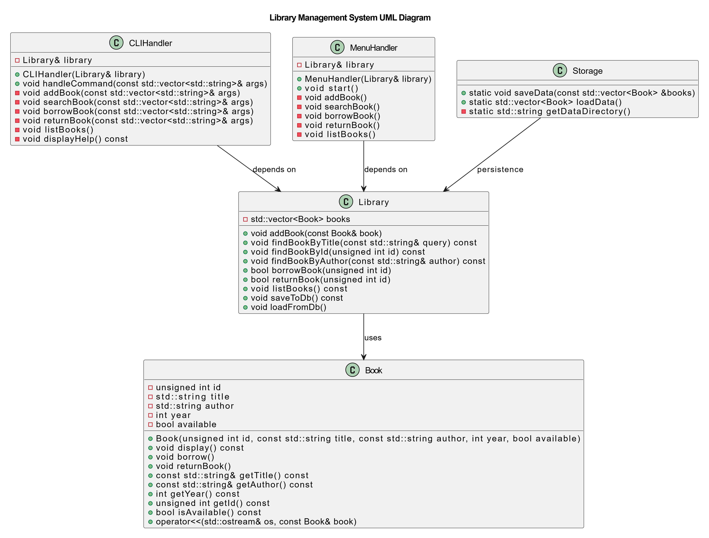

## The class structure of the Library Management System consists of the following components:

- Book: Represents individual book objects.
- Library: Manages the collection of books and provides operations like search, add, borrow, and return.
- Database: Handles persistence of book data in JSON format.

